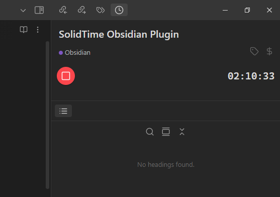

# SolidTime Integration Plugin for Obsidian

Connect Obsidian with your [SolidTime.io](https://solidtime.io/) account to seamlessly track your work time directly within your vault. Start, stop, and view your current timer without leaving Obsidian.

<!-- Add a screenshot of the sidebar view here -->

## Features

*   **Connect to SolidTime:** Securely connect to your SolidTime account using an API Token.
*   **Sidebar Tracker View:**
    *   Displays the currently running timer's description, project (with color indicator), and elapsed duration.
    *   Shows icons indicating billable status and whether tags are applied.
    *   Provides a prominent Play/Stop button to control the timer.
    *   Allows editing the running timer's description directly in the view.
    *   Allows changing the running timer's project via a suggestion modal.
    *   Allows toggling the billable status of the running timer.
    *   Allows selecting/deselecting tags for the running timer via a modal (includes creating new tags).
*   **Status Bar Item:** Shows the current timer's duration and project/description (configurable) in the Obsidian status bar.
*   **Commands:**
    *   Start Timer (opens a modal to select project, task (optional), description, tags, billable status).
    *   Stop Current Timer.
    *   Show Tracker View (opens the sidebar view).
    *   Show Current Timer Details (displays timer info in a notice).
    *   Refresh SolidTime Data (manually updates projects, tasks, tags).
    *   Refresh User Info.
*   **Modals:**
    *   Start Timer Modal for detailed entry creation.
    *   Project Suggestion Modal for quick project selection.
    *   Tag Selection Modal for managing tags on running timers (supports creating new tags).
*   **Automatic Refresh:** Periodically fetches updated project/task/tag lists and checks the current timer status (intervals configurable).

## Requirements

*   Obsidian v1.0.0 or higher.
*   A SolidTime account ([solidtime.io](https://solidtime.io/)).
*   A SolidTime Personal Access Token.

## Installation

### From Community Plugins (Recommended)

1.  Open Obsidian Settings > Community Plugins.
2.  Ensure "Restricted mode" is **off**.
3.  Click **Browse** community plugins.
4.  Search for "SolidTime Integration".
5.  Click **Install**.
6.  Once installed, click **Enable**.

### Manual Installation

1.  Download the latest release files (`main.js`, `manifest.json`, `styles.css`) from the [Releases page](https://github.com/pronicx/obsidian-solidtime-integration/releases/latest).
2.  Navigate to your Obsidian vault's plugins folder: `YourVault/.obsidian/plugins/`.
3.  Create a new folder named `obsidian-solidtime-integration`.
4.  Copy the downloaded `main.js`, `manifest.json`, and `styles.css` files into this new folder.
5.  Reload Obsidian (Ctrl/Cmd+R or close and reopen).
6.  Go to Settings > Community Plugins, find "SolidTime Integration", and enable it.

*(Alternatively, use the BRAT plugin to install pre-releases or directly from the repository URL.)*

## Configuration

After installing and enabling the plugin, you need to configure it:

1.  **Generate API Token:**
    *   Log in to your SolidTime account ([app.solidtime.io](https://app.solidtime.io/)).
    *   Navigate to your user profile settings / API section. [SolidTime API Token Guide](https://docs.solidtime.io/user-guide/access-api)
    *   Create a new Personal Access Token. Give it a descriptive name (e.g., "Obsidian Plugin").
    *   **Important:** Copy the generated token immediately. You won't be able to see it again.
2.  **Obsidian Settings:**
    *   Open Obsidian Settings > SolidTime Integration (in the sidebar under Community Plugins).
    *   **SolidTime API Key:** Paste the Personal Access Token you just generated.
    *   **SolidTime API Base URL:** This usually defaults to `https://app.solidtime.io/api`. Adjust only if you are using a self-hosted instance.
    *   **Active Organization:** Once the API Key and Base URL are entered correctly, this dropdown should populate with the organizations your user belongs to. Select the primary organization you want to track time for by default.
    *   **Default Billable:** Choose whether new timers started via the plugin should be marked as billable by default.
    *   **Status Bar Update Interval:** How often (in seconds) the status bar item should refresh the running timer's duration. Set to 0 to disable interval updates.
    *   **Data Auto-Fetch Interval:** How often (in minutes) the plugin should automatically fetch updated lists of projects, tasks, and tags from SolidTime. Set to 0 to disable automatic fetching (you can still use the "Refresh SolidTime Data" command).

## Usage

### Sidebar View

*   **Open:** Use the "SolidTime: Show Tracker View" command from the Command Palette (Ctrl/Cmd+P).
*   **Description:** Shows the current timer's description. Click on it to edit the description while the timer is running. Press Enter or click outside the input field to save.
*   **Project:** Shows the current timer's project (with its color). Click on it to open a modal and select a different project (or no project) for the running timer.
*   **Tag Icon (`tag`):** Appears faint if no tags are applied, and colored if tags are present. Click to open a modal where you can select/deselect existing tags or create new ones for the running timer.
*   **Billable Icon (`dollar-sign`):** Appears faint if not billable, and colored if billable. Click to toggle the billable status of the running timer.
*   **Play/Stop Button:**
    *   Shows a **Play** icon (green) when no timer is running. Click to open the "Start Timer" modal.
    *   Shows a **Stop** icon (red) when a timer is running. Click to stop the current timer.
*   **Duration:** Displays the elapsed time for the currently running timer (updates every second).

### Commands (Command Palette: Ctrl/Cmd+P)

*   **SolidTime: Start Timer (Prompt):** Opens a modal allowing you to enter a description, select a project, task (optional), tags, and set billable status before starting a new timer.
*   **SolidTime: Stop Current Timer:** Stops the currently running timer, if any.
*   **SolidTime: Show Tracker View:** Opens or focuses the sidebar view.
*   **SolidTime: Show Current Timer Details:** Shows a notification with details about the currently running timer.
*   **SolidTime: Refresh SolidTime Data:** Manually fetches the latest projects, tasks, and tags from your SolidTime account.
*   **SolidTime: Refresh User Info:** Manually refetches your user details from SolidTime.

### Status Bar

*   An item appears in the bottom status bar.
*   When idle, it shows "SolidTime" (or "Setup Needed" if not configured).
*   When a timer is running, it displays an icon (⏱️), the elapsed duration, and potentially the project name and truncated description. Hover over it for more details.

## Contributing

Contributions, bug reports, and feature requests are welcome! Please feel free to open an issue or submit a pull request on the [GitHub repository](https://github.com/pronicx/obsidian-solidtime-integration).

## Support

If you find this plugin helpful, consider supporting me. Every help is appreciated.

## License

This plugin is released under the [MIT License](LICENSE).

## Acknowledgements

*   Uses the [SolidTime API](https://solidtime.io/).
*   Uses the [Luxon](https://moment.github.io/luxon/) library for date/time handling (Bundled).
*   Built for [Obsidian](https://obsidian.md).
*    **Inspired by and oriented towards the structure of the [obsidian-toggl-integration](https://github.com/mcndt/obsidian-toggl-integration) plugin by @mcndt.**